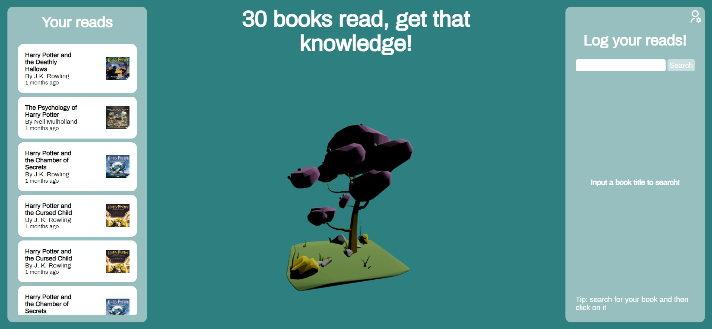

# Happy Bonsai

## Overview

"Happy Bonsai" is a creative application developed at BrainStation, combining 3D visualization and book tracking. Users can log reading activities and visualize their progress through a growing 3D bonsai tree.

## Screenshot

## Key Features

-   **3D Visualization:** Uses React Three Fiber for rendering bonsai trees.
-   **Book Tracking:** Integrates with Google Books API for managing book lists.
-   **User Authentication:** Securely handled through Firebase.

## Technologies Used

-   React, React-DOM
-   React Three Fiber, Three.js
-   Styled-Components
-   React Icons
-   React Router Dom
-   Axios
-   Firebase

## Live Application

Check out "Happy Bonsai" live [here](https://happy-bonsai.netlify.app/login).

## Running Locally

To run "Happy Bonsai" on your machine:

1.  Make sure you have this node version installed:

        16.20.0

2.  Clone the repository:

        git clone <repository-link>

3.  Install dependencies:

        npm install

4.  Start the application:

        npm start

The app will run on `localhost:3000`.
